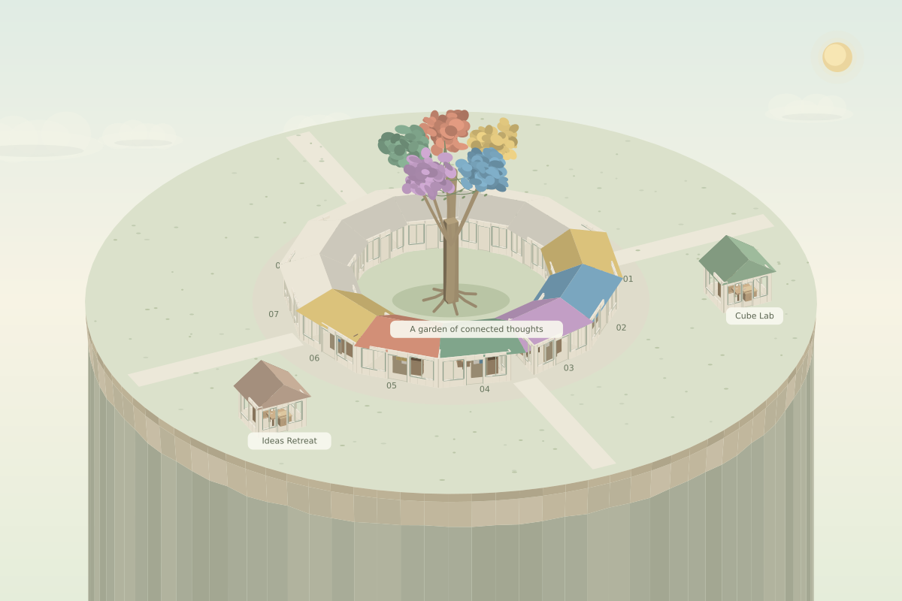
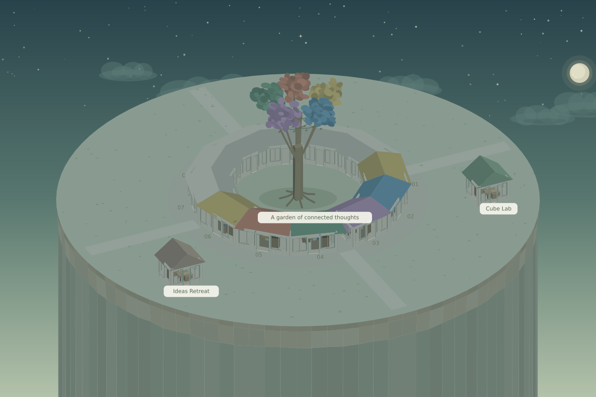

# Release 0.6 — 検証記録

実施: 2026-10-06

| 検証 | 結果 |
|---|---|
| ドメイン・API・建築・歩行・配置・天気・地盤・公開認証・課金ガード・Render/PostgreSQL | 85件 PASS |
| TypeScript `tsc --noEmit` | PASS |
| `git diff --check` | PASS |
| 独立公開用Vite/Vinext本番ビルド | PASS |
| Render用Viteクライアント本番ビルドと圧縮 | PASS。クライアントへDB・OAuthの秘密値を渡さない |
| PostgreSQL実エンジンでの保存・履歴・消去 | PGliteでPASS。実Neonへの接続は未検証 |
| 起動前スキーマ検査 | 必要なSQL関数が欠けているDBを拒否 |
| 実際のRender/Neon契約・secrets・DBの確認 | アカウント接続待ち。仮設定で公開しない |
| リリースコマンドの未設定時 | ローカル本番設定がないため停止し、ネットワーク公開処理へ進まない |
| 地盤の静止描画 | 昼・夜・部屋・窓越し・一人称の描画命令をSVG/PNGに変換して確認 |
| ブラウザのレイアウト・ドラッグ・キーボード・OAuth・本番CPU | 未検証。対応するブラウザ検証環境と外部アカウント接続が必要 |

地盤は深さ2048まで連続する崖として延長した。地盤テストは上面の半径・高さの保持、外周家屋と地面の一致、各層・円周継ぎ目の連続性、見える側の描画、画面内の土層を確認。320×2400から3840×2160、最小・最大の傾きとズーム、複数の回転方向で下端が画面下100pxより外側にあることを確認。投影とドラッグ座標は共通のカメラ変更後も往復する。

Render用Node/PostgreSQL対応を実装した。世界と履歴の原子的保存、同時更新の勝者1件・競合1件、失敗時の全体ロールバック、別所有者の分離、本人の原子的消去と古いrevisionの拒否、履歴キーの大文字小文字、署名済みセッションの画面起動、管理者制限、保存停止、秘密値のエラー抑制、静的ファイルの圧縮・パス制限・symlink拒否を検証した。公開用HTTPサーバーの実ネットワーク運用とNeon HTTP接続は未検証。テストはWeb Requestハンドラーを直接呼び出しており、対応外のブラウザQAを代用するローカルサーバーは起動していない。

ユーザーはRenderへログイン済みと報告したが、操作用ブラウザにはログイン画面が表示されている。共有されたログイン成功、契約、支払い方法未登録は確認できていない。公開先の選定・実アカウント作成手順はRENDER_DEPLOYMENT.md、管理・復旧はRENDER_OPERATIONS.mdに記録した。外部一般公開は未完了。

公開認証のテストは、入力ヘッダーの除去、署名・有効期限・発行元・用途の検証、安定した所有者ID、Cookie重複拒否、OAuth state / PKCE、同一オリジン更新、管理者制限、保存停止、エラー内の秘密情報抑制、本人だけの原子的消去と失敗時のロールバックを確認。プロバイダーはテスト内の応答を使用しており、本物のGitHubログインは未実施。

課金ガードは仮ID、不適切なホスト、有料サービス設定、公開変数への秘密値、有料・試用・未知の契約を拒否する。実際の契約状態の確認は対象アカウントを接続するまで完了しない。

これらはアプリと同じ3D描画命令から生成した静止画像。ブラウザ全体のスクリーンショットや操作試験ではない。ネイティブSitesの本番ビルド・保存・本人限定デプロイは別の公開処理で完了を確認する。外部の一般公開が成功したとは扱わない。
